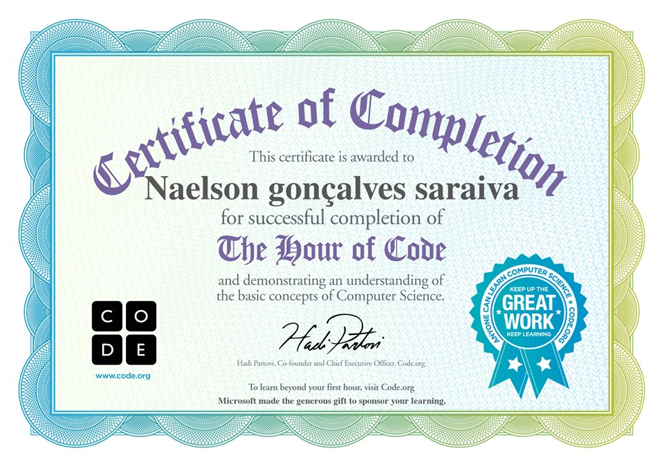
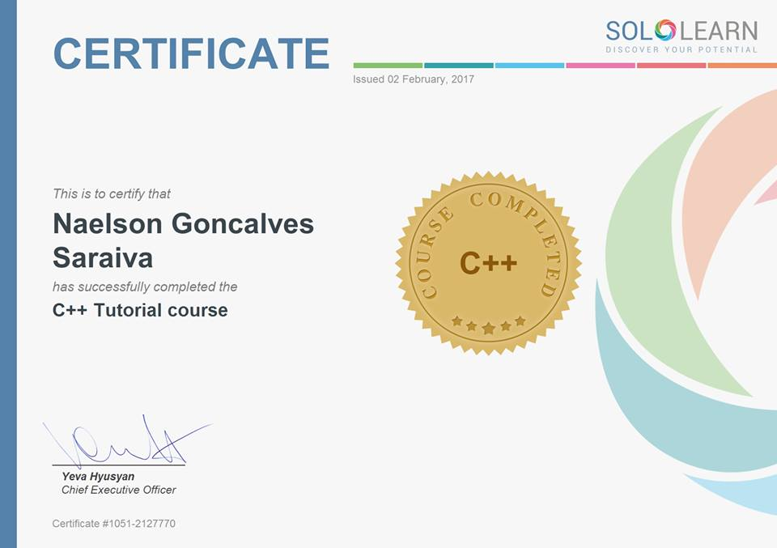
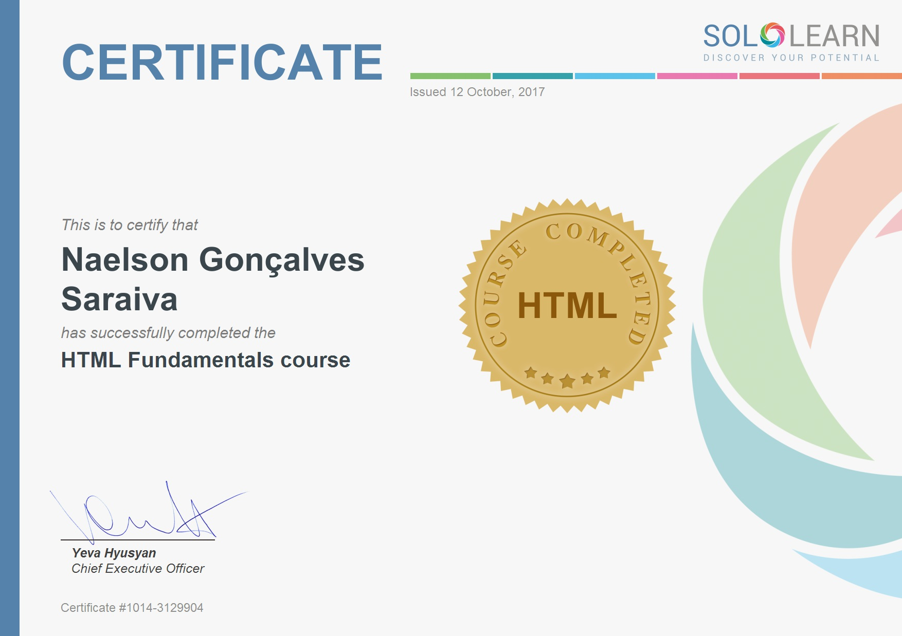
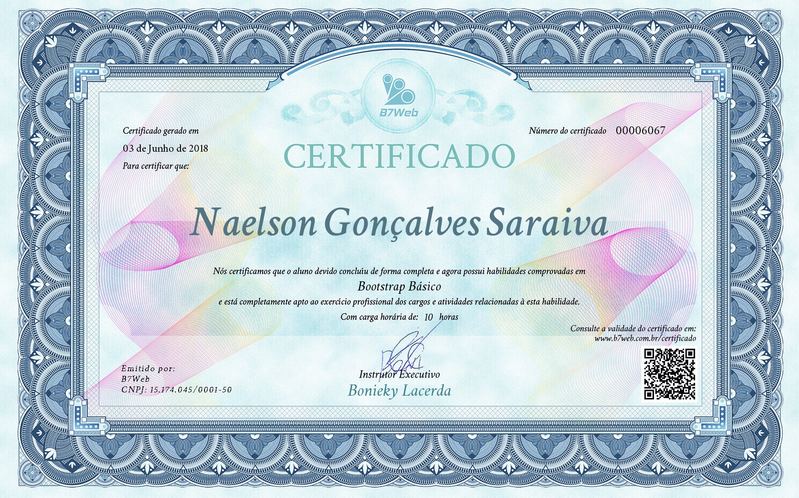

# 👋 Olâ, meu nome é Naelson🇧🇷 
##### Whatsapp👉 (65) 981180218
##### Email👉 Naelson.g.saraiva@gmail.com

✨ Trabalho como Desenvolvedor Web, eu crio e programo coisas que funcionam no 🖥️ computador.
---
### 📚 De onde vim.<br>
⚓ Plataformas de freelancers e antigas comunidades aberta, desde 2011 aprendendo e ensinando, respeitando outros membros e consequêntemente evoluindo como profissional em SoftSkills e HardSkills.<br>

### Interesses
📗 Atualmente estou explorando o campo Deep Math, como algebra 1,2, geometria [Link](https://github.com/devnaelson/math)<br>
📘 Alcançar uma fluência em english.<br>
⚡ Gosto de 🎮 jogar Video Game, 🚴 bike, 😃 valorizo o tempo como também o silencio da 🌱 natureza.<br>

### Certificações 

&nbsp;&nbsp;&nbsp;&nbsp;&nbsp;&nbsp;&nbsp;&nbsp;&nbsp;&nbsp;&nbsp;&nbsp;&nbsp;&nbsp;&nbsp;&nbsp;&nbsp;&nbsp;&nbsp;&nbsp;&nbsp;&nbsp;&nbsp;&nbsp;&nbsp;&nbsp;&nbsp;&nbsp;&nbsp;&nbsp;&nbsp;&nbsp;&nbsp;&nbsp;&nbsp;&nbsp;&nbsp;&nbsp;&nbsp;&nbsp;&nbsp;&nbsp;&nbsp;&nbsp;&nbsp;&nbsp;&nbsp;<br>

&nbsp;&nbsp;&nbsp;&nbsp;&nbsp;&nbsp;&nbsp;&nbsp;&nbsp;&nbsp;&nbsp;

&nbsp;&nbsp;&nbsp;&nbsp;&nbsp;&nbsp;&nbsp;&nbsp;&nbsp;&nbsp;&nbsp;

&nbsp;&nbsp;&nbsp;&nbsp;&nbsp;&nbsp;&nbsp;&nbsp;&nbsp;

&nbsp;&nbsp;&nbsp;&nbsp;&nbsp;&nbsp;&nbsp;&nbsp;&nbsp;

&nbsp;&nbsp;&nbsp;&nbsp;&nbsp;&nbsp;&nbsp;&nbsp;&nbsp;


&nbsp;&nbsp;&nbsp;&nbsp;&nbsp;&nbsp;&nbsp;&nbsp;&nbsp;&nbsp;&nbsp;&nbsp;&nbsp;&nbsp;&nbsp;&nbsp;&nbsp; View C++ 
&nbsp;&nbsp;&nbsp;&nbsp;&nbsp;&nbsp;&nbsp;&nbsp;&nbsp;&nbsp;&nbsp;&nbsp;&nbsp;&nbsp;&nbsp; View Html&Css
&nbsp;&nbsp;&nbsp;&nbsp;&nbsp;&nbsp;&nbsp;&nbsp;&nbsp;&nbsp;&nbsp; View JavaScript
&nbsp;&nbsp;&nbsp;&nbsp;&nbsp;&nbsp;&nbsp;&nbsp;&nbsp;&nbsp;&nbsp;&nbsp; View Mysql
&nbsp;&nbsp;&nbsp;&nbsp;&nbsp;&nbsp;&nbsp;&nbsp;&nbsp;&nbsp;&nbsp;&nbsp;&nbsp;&nbsp;&nbsp;&nbsp;&nbsp;&nbsp; View Html

&nbsp;&nbsp;&nbsp;&nbsp;&nbsp;&nbsp;&nbsp;&nbsp;&nbsp;&nbsp;&nbsp;&nbsp;&nbsp;&nbsp;&nbsp;&nbsp;&nbsp;&nbsp;&nbsp;&nbsp;&nbsp;&nbsp;&nbsp;&nbsp;&nbsp;&nbsp;&nbsp;&nbsp;&nbsp;&nbsp;&nbsp;&nbsp;&nbsp;&nbsp;&nbsp;&nbsp;&nbsp;&nbsp;&nbsp;&nbsp;&nbsp;&nbsp;&nbsp;&nbsp;&nbsp;&nbsp;&nbsp;&nbsp;&nbsp;&nbsp;&nbsp;
&nbsp;&nbsp;&nbsp;&nbsp;&nbsp;&nbsp;&nbsp;&nbsp;&nbsp;

&nbsp;&nbsp;&nbsp;&nbsp;&nbsp;&nbsp;&nbsp;&nbsp;&nbsp;


&nbsp;&nbsp;&nbsp;&nbsp;&nbsp;&nbsp;&nbsp;&nbsp;&nbsp;&nbsp;&nbsp;&nbsp;&nbsp;&nbsp;&nbsp;&nbsp;&nbsp;&nbsp;&nbsp;&nbsp;&nbsp;&nbsp;&nbsp;&nbsp;&nbsp;&nbsp;&nbsp;&nbsp;&nbsp;&nbsp;&nbsp;&nbsp;&nbsp;&nbsp;&nbsp;&nbsp;&nbsp;&nbsp;&nbsp;&nbsp;&nbsp;&nbsp;&nbsp;&nbsp;&nbsp;&nbsp;&nbsp;&nbsp;&nbsp;&nbsp;&nbsp;&nbsp;&nbsp;&nbsp;&nbsp; View Php
&nbsp;&nbsp;&nbsp;&nbsp;&nbsp;&nbsp;&nbsp;&nbsp;&nbsp; View Facebk Hora Code
&nbsp;&nbsp; View Bootstrap

### Experiências Seguintes tecnologias<br>

  ⚠️ Linguagens BackEnd:<br>
 ➕ Php,<br>
 ➕ Node,<br>
 ➕ C++,<br>
 ➕ C,<br>
 ➕ Phyton.<br>

 ⚠️ Linguagens Front End: JavaScript;<br>
 💬 Foco em Back End, mas tenho experiências em telas, Photoshop fatiar layouts e montar ou agregar backend.<br>
 ➕ Html<br>
 ➕ Css<br>
 ➕ COMPILED Sass<br>
 ➕ Jquery<br>
 ➕ ReactJS<br>
 ➕ NextJS<br>
 ➕ VueJS<br>
 ➕ Library: Bootstrap, Boost C++, MysqlConnectorC++, PHPUnit, Guzzle, PHP dotenv...<br>
 ➕ Frameworks: Codeigniter, Laravel, Non-Framework Avançado em WordPress. <br>
 ➕ Outras experiências:<br> 
&nbsp;&nbsp;&nbsp;&nbsp;&nbsp;&nbsp;&nbsp;&nbsp;&nbsp;&nbsp;&nbsp;&nbsp;&nbsp;&nbsp;&nbsp;&nbsp;&nbsp;&nbsp;&nbsp;&nbsp;&nbsp;&nbsp;&nbsp;&nbsp;&nbsp;&nbsp;&nbsp;&nbsp;&nbsp;&nbsp;&nbsp;&nbsp;&nbsp;&nbsp;&nbsp;&nbsp;&nbsp;&nbsp;1 Linux Ubuntu<br>
&nbsp;&nbsp;&nbsp;&nbsp;&nbsp;&nbsp;&nbsp;&nbsp;&nbsp;&nbsp;&nbsp;&nbsp;&nbsp;&nbsp;&nbsp;&nbsp;&nbsp;&nbsp;&nbsp;&nbsp;&nbsp;&nbsp;&nbsp;&nbsp;&nbsp;&nbsp;&nbsp;&nbsp;&nbsp;&nbsp;&nbsp;&nbsp;&nbsp;&nbsp;&nbsp;&nbsp;&nbsp;&nbsp;2 Windows Server ou pessoal<br>
&nbsp;&nbsp;&nbsp;&nbsp;&nbsp;&nbsp;&nbsp;&nbsp;&nbsp;&nbsp;&nbsp;&nbsp;&nbsp;&nbsp;&nbsp;&nbsp;&nbsp;&nbsp;&nbsp;&nbsp;&nbsp;&nbsp;&nbsp;&nbsp;&nbsp;&nbsp;&nbsp;&nbsp;&nbsp;&nbsp;&nbsp;&nbsp;&nbsp;&nbsp;&nbsp;&nbsp;&nbsp;&nbsp;3 Git [Link](https://github.com/devnaelson/git)<br>
&nbsp;&nbsp;&nbsp;&nbsp;&nbsp;&nbsp;&nbsp;&nbsp;&nbsp;&nbsp;&nbsp;&nbsp;&nbsp;&nbsp;&nbsp;&nbsp;&nbsp;&nbsp;&nbsp;&nbsp;&nbsp;&nbsp;&nbsp;&nbsp;&nbsp;&nbsp;&nbsp;&nbsp;&nbsp;&nbsp;&nbsp;&nbsp;&nbsp;&nbsp;&nbsp;&nbsp;&nbsp;&nbsp;4 Mysql Server Microsoft<br>
&nbsp;&nbsp;&nbsp;&nbsp;&nbsp;&nbsp;&nbsp;&nbsp;&nbsp;&nbsp;&nbsp;&nbsp;&nbsp;&nbsp;&nbsp;&nbsp;&nbsp;&nbsp;&nbsp;&nbsp;&nbsp;&nbsp;&nbsp;&nbsp;&nbsp;&nbsp;&nbsp;&nbsp;&nbsp;&nbsp;&nbsp;&nbsp;&nbsp;&nbsp;&nbsp;&nbsp;&nbsp;&nbsp;5 Mysql Oracle<br>
&nbsp;&nbsp;&nbsp;&nbsp;&nbsp;&nbsp;&nbsp;&nbsp;&nbsp;&nbsp;&nbsp;&nbsp;&nbsp;&nbsp;&nbsp;&nbsp;&nbsp;&nbsp;&nbsp;&nbsp;&nbsp;&nbsp;&nbsp;&nbsp;&nbsp;&nbsp;&nbsp;&nbsp;&nbsp;&nbsp;&nbsp;&nbsp;&nbsp;&nbsp;&nbsp;&nbsp;&nbsp;&nbsp;6 MongoDB<br>
&nbsp;&nbsp;&nbsp;&nbsp;&nbsp;&nbsp;&nbsp;&nbsp;&nbsp;&nbsp;&nbsp;&nbsp;&nbsp;&nbsp;&nbsp;&nbsp;&nbsp;&nbsp;&nbsp;&nbsp;&nbsp;&nbsp;&nbsp;&nbsp;&nbsp;&nbsp;&nbsp;&nbsp;&nbsp;&nbsp;&nbsp;&nbsp;&nbsp;&nbsp;&nbsp;&nbsp;&nbsp;&nbsp;7 Json<br>
&nbsp;&nbsp;&nbsp;&nbsp;&nbsp;&nbsp;&nbsp;&nbsp;&nbsp;&nbsp;&nbsp;&nbsp;&nbsp;&nbsp;&nbsp;&nbsp;&nbsp;&nbsp;&nbsp;&nbsp;&nbsp;&nbsp;&nbsp;&nbsp;&nbsp;&nbsp;&nbsp;&nbsp;&nbsp;&nbsp;&nbsp;&nbsp;&nbsp;&nbsp;&nbsp;&nbsp;&nbsp;&nbsp;8 Struturas de dados<br>
&nbsp;&nbsp;&nbsp;&nbsp;&nbsp;&nbsp;&nbsp;&nbsp;&nbsp;&nbsp;&nbsp;&nbsp;&nbsp;&nbsp;&nbsp;&nbsp;&nbsp;&nbsp;&nbsp;&nbsp;&nbsp;&nbsp;&nbsp;&nbsp;&nbsp;&nbsp;&nbsp;&nbsp;&nbsp;&nbsp;&nbsp;&nbsp;&nbsp;&nbsp;&nbsp;&nbsp;&nbsp;&nbsp;9 Aplicar Desing Pattern [Link](https://github.com/devnaelson/design-pattarens-php)<br>
&nbsp;&nbsp;&nbsp;&nbsp;&nbsp;&nbsp;&nbsp;&nbsp;&nbsp;&nbsp;&nbsp;&nbsp;&nbsp;&nbsp;&nbsp;&nbsp;&nbsp;&nbsp;&nbsp;&nbsp;&nbsp;&nbsp;&nbsp;&nbsp;&nbsp;&nbsp;&nbsp;&nbsp;&nbsp;&nbsp;&nbsp;&nbsp;&nbsp;&nbsp;&nbsp;&nbsp;&nbsp;&nbsp;10 Basico de Docker [Link](https://github.com/devnaelson/docker-devna)<br>
&nbsp;&nbsp;&nbsp;&nbsp;&nbsp;&nbsp;&nbsp;&nbsp;&nbsp;&nbsp;&nbsp;&nbsp;&nbsp;&nbsp;&nbsp;&nbsp;&nbsp;&nbsp;&nbsp;&nbsp;&nbsp;&nbsp;&nbsp;&nbsp;&nbsp;&nbsp;&nbsp;&nbsp;&nbsp;&nbsp;&nbsp;&nbsp;&nbsp;&nbsp;&nbsp;&nbsp;&nbsp;&nbsp;10 PHP Unit Test TDD [Link](https://github.com/devnaelson/phpunit)<br>
&nbsp;&nbsp;&nbsp;&nbsp;&nbsp;&nbsp;&nbsp;&nbsp;&nbsp;&nbsp;&nbsp;&nbsp;&nbsp;&nbsp;&nbsp;&nbsp;&nbsp;&nbsp;&nbsp;&nbsp;&nbsp;&nbsp;&nbsp;&nbsp;&nbsp;&nbsp;&nbsp;&nbsp;&nbsp;&nbsp;&nbsp;&nbsp;&nbsp;&nbsp;&nbsp;&nbsp;&nbsp;&nbsp;11 Aprendendo há alguns anos Assembly Intelx64/x86 [Link](https://github.com/devnaelson/assembly)<br>

-----
### Referências<br>
---
#### Workana
- 8 Projetos Completos
- [](https://www.workana.com/freelancer/3d5b284ed454af818e8aa91affd21945)
---
#### MaxCheaters
- 2 Projetos Abertos Posts:156/Reputation:13
- [](https://maxcheaters.com/profile/176942-naelson/)
---
#### L2JBrasil

- L2JBrasil inscrição Junho 6/2011
- Umas das comunidades mais antigas que tem como foco estudos de emuladores, desenvolvimento de sites, banco de dados entre diversas outras coisas relacionadas a técnologias.
- Status: Super Membro 
- Postes: 1059
- Reputação: 251
- [](https://www.l2jbrasil.com/profile/54325-naelson/)

- ⚠️ Referências de empresas atribuidas no curriculum.<br>

---

### Veja algumas coisas que fiz.

 ⚙️ [Gerador de Sites](https://github.com/devnaelson/devnaelson/blob/main/projects/l2off-dashboard/view.md)  ```(JavaScript,Html,Css,Php,Mysql Server)``` 🔓 open code<br>
 ⚙️ [Cpanel L2OFF](https://github.com/devnaelson/devnaelson/blob/main/projects/l2off-cpanel/view.md)  ```(JavaScript,Html,Css,Php,Codeigniter,Paypal,Mysql Server)``` 🔓 open code<br>
 ⚙️ [Vendas Afiliados](https://github.com/devnaelson/devnaelson/blob/main/projects/card-affiliate/view.md)  ```(JavaScript,HTML,CSS)``` 🔓 open code<br>
 ⚙️ [Extensão ocultar contatos do Whatsapp](https://github.com/devnaelson/devnaelson/blob/main/projects/hide-whatsapp/view.md) ```(JavaScript,HTML,CSS)``` 🔓 open <br>
 ⚙️ [Gateway Split Pagamento](#) ```(Php,Jquery,Mysql,Html,Css,WordPress Plugins)``` 🔒 private <br>

 ⚙️ [Tela Forum Games](https://github.com/devnaelson/devnaelson/blob/main/image/layout-forum.jpg) ```(Psd,Photoshop)``` 🔓 open <br>
 ⚙️ [Tela RPG](https://github.com/devnaelson/devnaelson/blob/main/image/layout02.png) ```(Psd,Fatiar, Montar Css,Hml,Js)``` 🔓 open <br>
 ⚙️ [Tela RPG Advanger](https://github.com/devnaelson/devnaelson/blob/main/image/avenger.jpg) ```(Psd,Fatiar, Montar Css,Hml,Js)``` 🔓 open <br>

---
### 🔥 Stack<br>


---
### Perfil do LinkedIn
[](https://www.linkedin.com/in/devnaelson/)
